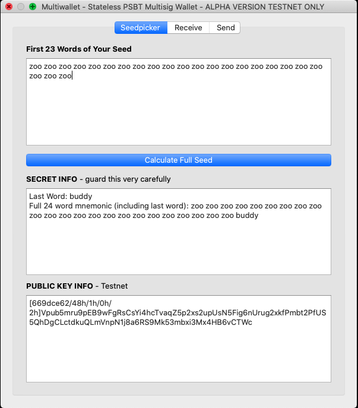
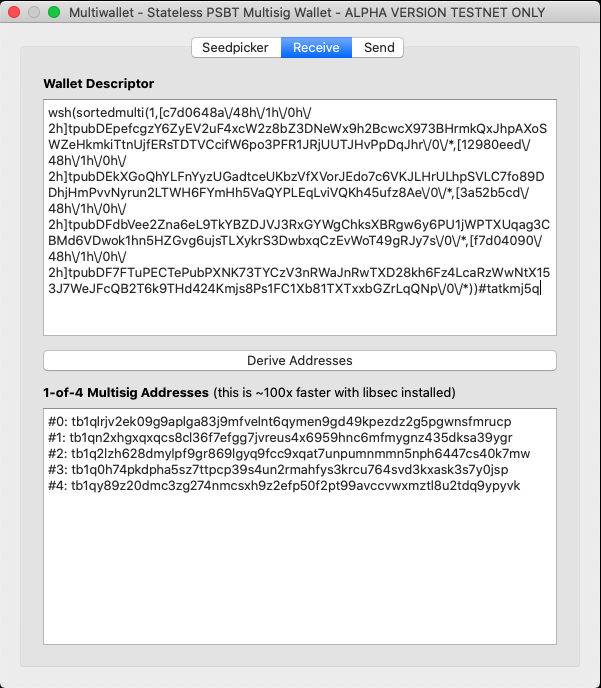
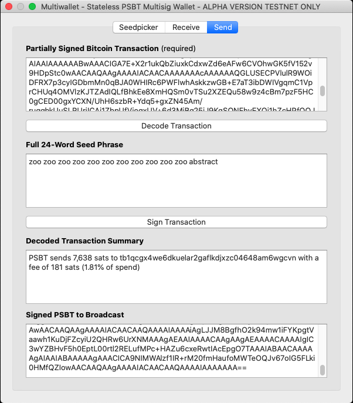

# THIS REPOSITORY COMES WITH ZERO GUARANTEES! USE AT YOUR OWN RISK!

GUI version of CLI [multiwallet](https://twitter.com/mflaxman/status/1321503036724989952).

#### Seedpicker


#### Recieve


#### Send


## Install

#### Easy
Downloadable binary link here (MacOS only):
<https://github.com/mflaxman/multiwallet/releases>

#### Medium
```bash
$ pip3 install multiwallet
$ multiwallet_gui
```

#### Advanced
```bash
git clone https://github.com/mflaxman/multiwallet.git
cd multiwallet
python3 -m virtualenv .venv3
source .venv3/bin/activate
python3 setup.py develop
python multiwallet_gui/app.py 
```

## Make a Release

Downloadable MacOS binary:
```
$ time ./make_macos_release.sh 
```

TODO:
* libsec
* better form handling/validation
* test/release on multiple OS
* reproducible build
* Make it look better
* Add QR codes
* Mainnet/testnet toggle
* Add webcam
* Support arbitrary paths
* Dark mode
